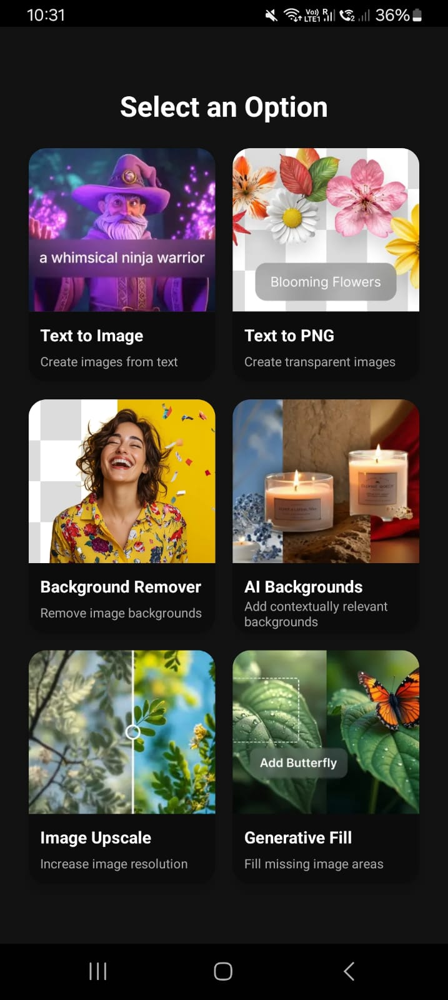
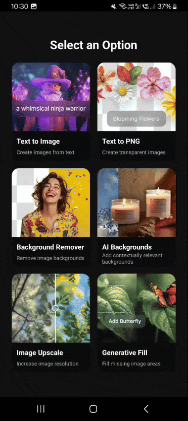

# 🎨 **Renderly – AI-Powered Image Toolkit**

**Renderly** is a sleek, AI-enhanced image editing app that puts powerful visual tools right at your fingertips. Whether you're creating art from text, removing backgrounds, or enhancing image quality — Renderly makes it fast, intuitive, and fun.

---

## 🏠 Homepage

  
*📸 A look at the Renderly home screen.*

---

## 🚀 Features

| Feature              | Description                                                                 |
|----------------------|-----------------------------------------------------------------------------|
| 🧙‍♂️ Text to Image     | Generate stunning AI art from a simple text prompt.                         |
| 🌸 Text to PNG        | Turn words into transparent PNGs for stickers and design assets.            |
| ✂️ Background Remover | Erase image backgrounds with a single tap.                                  |
| 🕯 AI Backgrounds     | Automatically add beautiful, context-aware backgrounds.                     |
| 🔍 Image Upscale      | Improve resolution and bring details to life.                               |
| 🦋 Generative Fill    | Intelligently fill missing or empty parts of an image.                      |

---

## 🎥 Live Demo

### ✂️ Background Remover in Action

### 🦋 Generative Fill in Action

---

> 📲 *Renderly is designed for a mobile-first experience — optimized for Android.*

---

## 🛠 Built With

- **React Native** – Mobile app framework
- **OpenAI / Stable Diffusion API** – For text-to-image generation
- **Remove.bg API or Custom Model** – For background removal
- **Image Upscaler Models** – For resolution enhancement
- **Custom Generative Fill AI** – For smart inpainting

---

## 🙌 Contributing

Pull requests are welcome! If you have cool feature ideas or want to improve performance, feel free to contribute.
